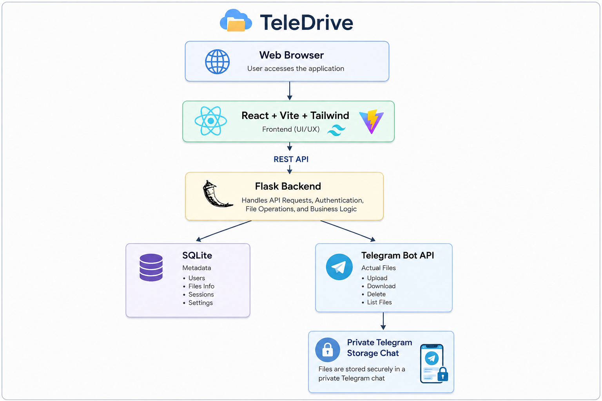

# 📁 TeleDrive

> **A self-hosted personal cloud file manager that uses Telegram as its storage backend.**

TeleDrive provides a Google Drive-like web interface while using **Telegram** as the actual file storage backend. SQLite stores only metadata — the real file binaries live in your private Telegram storage chat.

**No authentication. No user accounts. No registration.** TeleDrive is designed to be run by its owner on their own server or local machine.

---

## ✨ Features

### File Management
- 🗂 **Google Drive-like dashboard** with grid/list views
- 📤 **Drag & drop** file uploads with progress indicators
- 📁 **Nested folders** with breadcrumb navigation
- 📄 **File previews** for images, videos, PDFs, and text/code files
- ✏️ **Inline text editor** for code and text files (with syntax highlighting)
- 📥 **Download** with streaming (no full-file RAM loading)
- 🔍 **Search** by filename, extension, or MIME type
- ⭐ **Starred** files for quick access
- 🕐 **Recent** files view
- 🗑 **Trash** with restore and permanent delete
- 📤 **Rename, move, star, trash** files and folders
- ↕️ **Sorting** by name, size, date created, date modified, type

### Telegram Integration
- 📡 **Telegram sync** — files sent manually to the storage chat appear in the dashboard
- 🔄 **Webhook support** for production real-time sync
- 🔒 **Security-focused** with no authentication complexity

---

## 🏗 Architecture



- **Telegram** = actual file storage
- **SQLite** = metadata/index
- **Flask** = backend/API
- **React** = frontend

---

## 📁 Project Structure

```
TeleDrive/
├── Backend/                    # Flask backend
│   ├── app.py                  # Application factory
│   ├── config.py               # Configuration
│   ├── extensions.py           # Flask extensions (db, limiter)
│   ├── init_db.py              # Database initialization script
│   ├── requirements.txt        # Python dependencies
│   ├── Dockerfile              # Backend Docker image
│   ├── .env.example            # Environment variable template
│   ├── models/                 # SQLAlchemy models
│   │   ├── file.py             # File metadata model
│   │   └── folder.py           # Folder model
│   ├── routes/                 # API route blueprints
│   │   ├── files.py            # File endpoints
│   │   ├── folders.py          # Folder endpoints
│   │   └── telegram.py         # Telegram sync endpoints
│   ├── services/               # Business logic
│   │   ├── file_service.py     # File/folder operations
│   │   └── telegram_storage.py # Telegram Bot API service
│   └── utils/                  # Utilities
│       ├── errors.py           # Error handling & responses
│       └── validators.py       # Input validation
│
├── frontend/                   # React frontend
│   ├── src/
│   │   ├── App.jsx             # Main app with routing
│   │   ├── main.jsx            # Entry point
│   │   ├── components/         # UI components
│   │   │   ├── Sidebar.jsx     # Navigation sidebar
│   │   │   ├── Header.jsx      # Top header with search
│   │   │   ├── UploadModal.jsx # File upload modal
│   │   │   ├── FileCard.jsx    # File grid card
│   │   │   ├── FolderCard.jsx  # Folder grid card
│   │   │   ├── FileGrid.jsx    # Grid view
│   │   │   ├── FileList.jsx    # List view
│   │   │   ├── FilePreview.jsx # File preview modal
│   │   │   ├── ContextMenu.jsx # Right-click context menu
│   │   │   └── ConfirmDialog.jsx # Confirmation dialog
│   │   ├── hooks/
│   │   │   └── useFileManager.js # Shared file management logic
│   │   ├── pages/
│   │   │   ├── Dashboard.jsx   # Home page
│   │   │   ├── Folder.jsx      # Folder view
│   │   │   ├── Recent.jsx      # Recent files
│   │   │   ├── Starred.jsx     # Starred files
│   │   │   ├── Trash.jsx       # Trash view
│   │   │   └── Settings.jsx    # Settings page
│   │   ├── services/           # API service functions
│   │   │   ├── api.js          # Axios instance
│   │   │   ├── files.js        # File API calls
│   │   │   └── folders.js      # Folder API calls
│   │   └── utils/
│   │       └── fileTypes.js    # File type detection & formatting
│   ├── package.json            # Node dependencies
│   ├── vite.config.js          # Vite configuration
│   ├── tailwind.config.js      # Tailwind CSS configuration
│   ├── Dockerfile              # Frontend Docker image
│   └── nginx.conf              # Nginx configuration
│
├── docker-compose.yml          # Docker Compose setup
└── .gitignore                  # Git ignore rules
```

---

## 🚀 Installation

### Prerequisites

- **Python 3.11+**
- **Node.js 18+**
- **A Telegram Bot Token** (from [@BotFather](https://t.me/BotFather))
- **A Telegram chat/channel** to use as storage

---

### 1️⃣ Telegram Bot Setup

1. Open Telegram and message [@BotFather](https://t.me/BotFather)
2. Send `/newbot` and follow the prompts
3. Copy the bot token you receive

### 2️⃣ Storage Chat Setup

1. Create a **private channel** in Telegram
2. Add your bot as an **administrator** with permission to post messages
3. Get the channel ID:
   - Send a message to the channel
   - Visit `https://api.telegram.org/bot<YOUR_BOT_TOKEN>/getUpdates`
   - Find the `chat.id` — it will be negative, e.g., `-100123456789`
4. For production, consider setting a webhook:
   ```
   https://api.telegram.org/bot<YOUR_BOT_TOKEN>/setWebhook?url=https://your-domain.com/api/telegram/webhook
   ```

---

### 3️⃣ Environment Variables

Create `Backend/.env`:

```env
# Telegram Bot Configuration
# Get your bot token from @BotFather on Telegram
TELEGRAM_BOT_TOKEN=your-bot-token-here

# Telegram chat/channel ID where files will be stored
# For a private channel, prefix with -100 (e.g., -100123456789)
TELEGRAM_CHAT_ID=-100123456789

# Database connection string
# Default: SQLite file in the backend directory
DATABASE_URL=sqlite:///teledrive.db

# Maximum upload size in bytes (default: 10 GB)
MAX_UPLOAD_SIZE=10737418240

# Frontend origin for CORS (comma-separated for multiple)
FRONTEND_URL=http://localhost:5173

# Flask secret key — change in production
SECRET_KEY=change-me-in-production
```

> ⚠️ **Never commit your real `.env` file.** The Telegram bot token must stay server-side and never reach the frontend.

---

### 4️⃣ Backend Setup

```bash
cd Backend
python -m venv venv

# Windows
venv\Scripts\activate

# Linux/macOS
source venv/bin/activate

pip install -r requirements.txt
python init_db.py
python app.py
```

The backend runs at `http://localhost:5000`.

### 5️⃣ Frontend Setup

```bash
cd frontend
npm install
npm run dev
```

The frontend runs at `http://localhost:5173` and proxies `/api` requests to the backend.

---

### 🐳 Docker Setup

Create a `.env` file in the project root with your Telegram credentials:

```env
TELEGRAM_BOT_TOKEN=your-bot-token-here
TELEGRAM_CHAT_ID=-100123456789
```

Then run:

```bash
docker-compose up -d --build
```

- **Frontend:** `http://localhost:8080`
- **Backend API:** `http://localhost:5000`
- **SQLite data** persisted in a Docker volume

---

## 📡 API Documentation

### Response Format

**Success:**
```json
{
  "success": true,
  "data": {},
  "message": "Operation successful"
}
```

**Error:**
```json
{
  "success": false,
  "error": {
    "code": "FILE_NOT_FOUND",
    "message": "File not found"
  }
}
```

### Endpoints

| Method | Endpoint | Description |
|--------|----------|-------------|
| `GET` | `/api/health` | Health check |
| `GET` | `/api/files` | List files with filters |
| `POST` | `/api/files/upload` | Upload files (multipart, field name: `file`) |
| `GET` | `/api/files/<id>` | Get file metadata |
| `GET` | `/api/files/<id>/content` | Get text file content |
| `PUT` | `/api/files/<id>/content` | Save text file content |
| `GET` | `/api/files/<id>/download` | Download file (streamed) |
| `PATCH` | `/api/files/<id>` | Rename / move / star / trash / restore |
| `DELETE` | `/api/files/<id>` | Permanently delete |
| `POST` | `/api/trash/empty` | Empty trash |
| `GET` | `/api/folders` | List folders |
| `POST` | `/api/folders` | Create folder |
| `GET` | `/api/folders/<id>` | Get folder with contents & breadcrumbs |
| `PATCH` | `/api/folders/<id>` | Rename / move folder |
| `DELETE` | `/api/folders/<id>` | Delete folder |
| `POST` | `/api/telegram/sync` | Trigger Telegram sync |
| `POST` | `/api/telegram/webhook` | Telegram webhook endpoint (production) |

### Query Parameters for `GET /api/files`

| Parameter | Values | Description |
|-----------|--------|-------------|
| `folder` | int | Filter by folder ID |
| `search` | string | Search by name, extension, MIME type |
| `starred` | `true`/`false` | Filter starred |
| `trash` | `true`/`false` | Filter trashed |
| `type` | `image`, `video`, `audio`, `document`, `archive`, `code`, `text` | Filter by type |
| `sort_by` | `name`, `size`, `created_at`, `updated_at`, `type` | Sort field |
| `sort_order` | `asc`/`desc` | Sort direction |

---

## 🔒 Security

TeleDrive has **no authentication** by design — it's for personal use. Security is instead focused on:

- ✅ Telegram bot token kept **server-side only**
- ✅ CORS restricted to configured frontend origin
- ✅ `secure_filename()` path traversal protection
- ✅ File validation (MIME type, extension, size limits)
- ✅ Rate limiting on all API routes
- ✅ SQL injection prevention via SQLAlchemy
- ✅ XSS protection via security headers + React escaping
- ✅ Security headers (CSP, X-Frame-Options, etc.)
- ✅ Maximum request/upload size enforcement
- ✅ Safe error responses (no internal details leaked)
- ✅ Request validation on all API endpoints
- ✅ Blocked dangerous file extensions (`.exe`, `.bat`, `.sh`, etc.)

> ⚠️ **Deployment warning:** Only expose TeleDrive on your personal/private network. Do not expose it to the public internet without additional network-level protections (VPN, firewall, etc.).

---

## 🛠 Troubleshooting

### Upload fails with "Telegram upload failed"

- Verify `TELEGRAM_BOT_TOKEN` is correct
- Verify `TELEGRAM_CHAT_ID` is correct and the bot is a member/administrator
- Check the bot has permission to send documents in the chat

### Upload fails with "Request Entity Too Large" (HTTP 413)

- The default `MAX_UPLOAD_SIZE` is 10 GB (10737418240 bytes)
- Override it in `Backend/.env` if you need a different limit:
  ```env
  MAX_UPLOAD_SIZE=21474836480  # 20 GB
  ```
- If using Docker, also update `client_max_body_size` in `frontend/nginx.conf`
- Files over ~50 MB cannot be downloaded back through the Telegram Bot API
  (Telegram's `getFile` download limit). They are still stored in your
  Telegram chat but must be retrieved manually from there.

### Files sent to Telegram don't appear in dashboard

- Click **Settings → Sync from Telegram**
- For production, configure the webhook

### Upload is slow

- Telegram's Bot API has file size limits (50 MB for downloads via getFile)
- Large files may take time due to Telegram's infrastructure

### CORS errors

- Ensure `FRONTEND_URL` in `Backend/.env` matches your frontend origin

---

## 🤝 Contributing

1. Fork the repository
2. Create a feature branch (`git checkout -b feature/amazing-feature`)
3. Commit your changes (`git commit -m 'Add amazing feature'`)
4. Push to the branch (`git push origin feature/amazing-feature`)
5. Open a Pull Request

---

## 📄 License

MIT License — see the [LICENSE](LICENSE) file for details.

---

## 🙏 Acknowledgments

- [Telegram Bot API](https://core.telegram.org/bots/api) for providing the storage backend
- [Flask](https://flask.palletsprojects.com/) for the backend framework
- [React](https://react.dev/) for the frontend framework
- [Vite](https://vitejs.dev/) for the frontend build tool
- [Tailwind CSS](https://tailwindcss.com/) for styling
